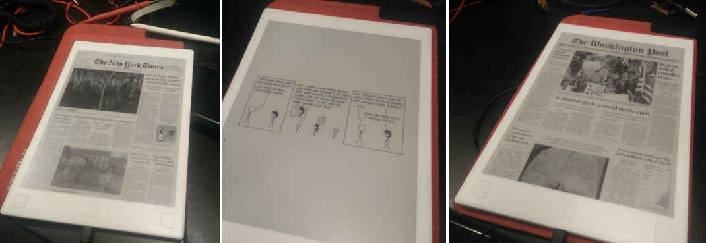

# remarkable_news

reMarkable service to automatically download daily newspaper/comic as your suspend screen.  No cloud needed.

## Quickstart (Linux/OSX)

    git clone http://github.com/evidlo/remarkable_news && cd remarkable_news
    make download_prebuilt
    make install_nyt

This will install and start the update service on the reMarkable.  Every time you connect to WiFi, it will try to grab the latest front page from The New York Times.

Alternatively, you can build the binary yourself before installation if you omit `make download_prebuilt`.

    make install_nyt

By default, downloads are rate limited to once per hour (3600 s).  This can be overriden

    # set rate limit to once per 10 min
    make install_nyt cooldown=600

## Install (Windows)

Install [WSL](https://docs.microsoft.com/en-us/learn/modules/get-started-with-windows-subsystem-for-linux/2-enable-and-install), then follow the Linux/OSX instructions.  This has not been tested.

## Supported News/Comics Sources

- XKCD - `make install_xkcd`
- Washington Post (only updates weekdays) - `make install_wp`
- New York Times (slightly low resolution) - `make install_nyt`
- New York Times (high quality provided by [acrogenesis/nyt-today](https://github.com/acrogenesis/nyt-today)) - `make install_nyt_hq`
- Picsum (random images) - `make install_picsum`
- Calvin and Hobbes - `make install_cah`
<!-- - Wikipedia Picture of the Day - `make install_wikipotd` -->

## Debugging

On the reMarkable

    journalctl --unit renews -f

Then disconnect and reconnect WiFi to trigger a download.  remarkable_news will only download at a maximum of once per hour to avoid burdening the server.

## Contributing

See [contributing.md](contributing.md)
