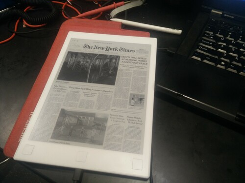

# remarkable_news

Automatically download daily newspaper/comic as your suspend screen.  No cloud needed.

## Install

Assuming you have Go installed

    make install_nyt
    
This will install and start the newspaper fetch service on the reMarkable.  Every time you connect to WiFi, it will try to grab the latest front page from New York Times.
    
Alternatively you can use the prebuilt release if you don't have Go

    make download_prebuilt
    make install_nyt
    
## Contributing

I'm looking for help adding more comics/news sources.  Currently remarkable_news supports `.jpg`, `.png`, `.tiff`, and `.bmp` sources.  New source URLs can be added to the [Makefile](Makefile).

## Debugging

    journalctl --unit renews -f
    
Then disconnect and reconnect WiFi to trigger a download.
